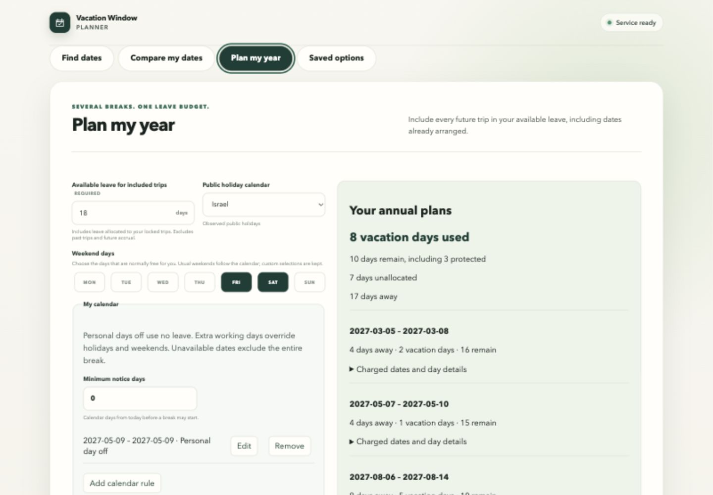

# Annual browser integration evidence

## AP 05 — structured workspace

September 26, 2026: rebuilt the local Compose application with migration `20260926_09`. Backend and database were healthy; `http://localhost:15173/api/health` returned `ok` / `connected`. Structured planning requires no model provider.

A live in-app-browser journey entered balance 18, reserve 3, Israel Friday/Saturday weekends, a personal day off on May 9, 2027, and the three exact-date slots from UX fixture A: March 5–8, May 7–10, August 6–14. Explicit generation displayed 17 days away, 8 leave days used, 10 remaining including the reserve, and 7 unallocated. Chronological balances were 16, 15 and 10. The newly persisted snapshot was independently read through `AnnualRunRepository` and matched those dates and balances.

The layout was inspected at 1,440×1,000 and 1,024×900. At 1,024 px, the sections stack and measured document width equals viewport width, with no horizontal overflow. Native date controls were exercised through accessibility setters; the in-app browser's generic date `fill` did not update them, so no application workaround was introduced.

Automated rendered journeys cover independent task draft, explicit generation, slot order/month/gap edits, manual range conversion, explicit saved-date selection without copying its calendar, incomplete lock-editor protection, conflict/cap/reduction states, and rejection of inconsistent accounting. The first full frontend run passed 84 tests; a subsequent lock-editor regression passed with the focused annual suite (10 tests). ESLint, Prettier, TypeScript and production build passed before that additional covered fix; final PR checks are recorded in its description.

Year visualization, richer comparison/recalculation, interpretation, saving whole plans and export belong to AP 06–09. This is milestone evidence, not AP 10 release acceptance or calendar-client import verification.
