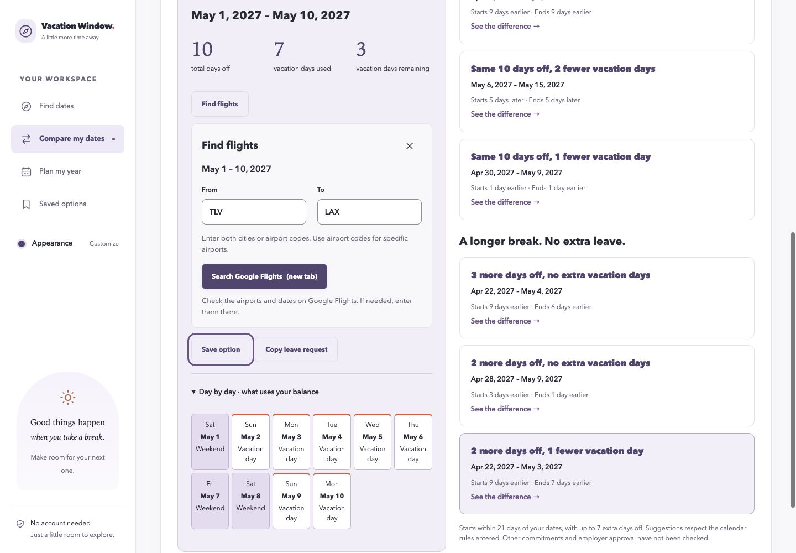
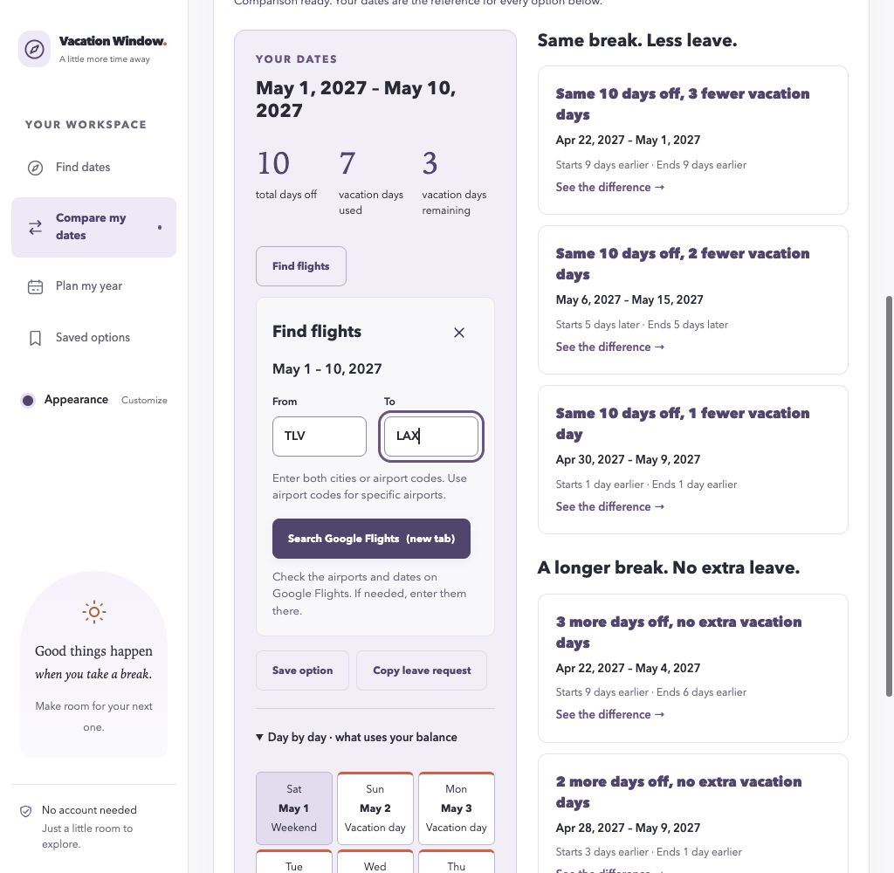
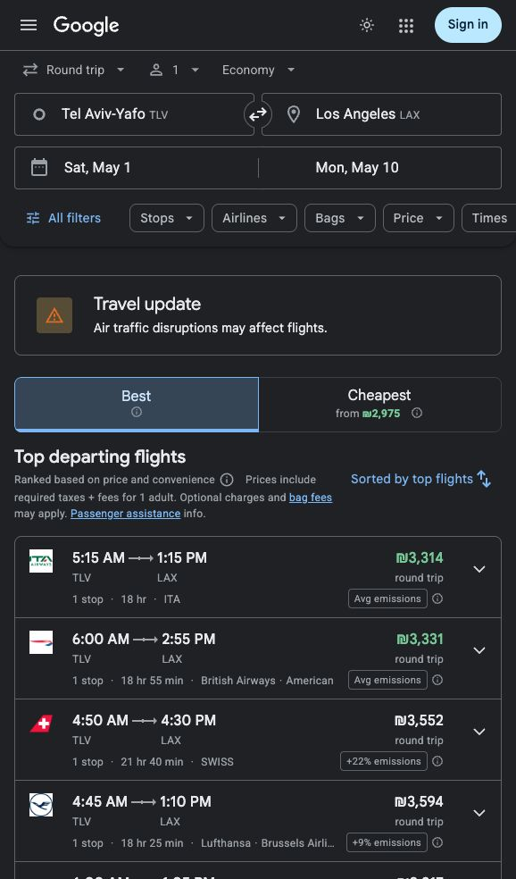
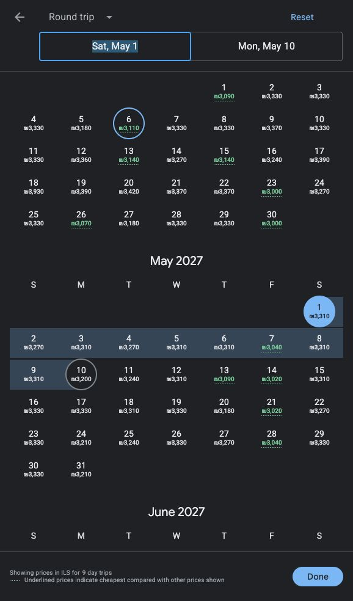

# Google Flights handoff

Verified on 2026-10-03 on `codex/flight-search-handoff` for [PR #87](https://github.com/rakreshet/vacation-window-planner/pull/87). The handoff opens a best-effort prefilled Google Flights search; it does not retrieve flight data or change planning calculations.

## Interaction

**Find flights** is available on individual Search windows, the baseline and selected Compare window, and individual breaks in current or saved annual plans. A compact inline panel shows the selected break's dates and manually entered **From** and **To** fields. Both locations are required; cities and airport codes are accepted, with airport codes suggested when users want specific airports.

The panel has one **Search Google Flights (new tab)** action, enabled only when both trimmed locations are nonempty. The large travel-details textarea, “Vacation break” text, copy action, and bottom close button are removed. An accessible × button sits at the top-right of the panel with the name **Close flight panel**. Opening focuses the heading; × and Escape return focus to the opener.

Stale or pending current results disable Find flights with a visible explanation. Changing the selected plan, break, calculation, or workspace invalidates an open panel. Historical annual plans retain their visible saved name, calculation time, and timezone, and the handoff works offline. No handoff action writes saved snapshots, calls a provider, or changes leave calculations, budgets, reserves, or locks.

## URL and reliability

The client constructs an ordinary link to `https://www.google.com/travel/flights` using `URL` and `URLSearchParams`:

```text
q=Flights from {trimmed From} to {trimmed To} on {start_date} returning {end_date}
hl=en
```

The link uses `target="_blank"` and `rel="noopener noreferrer"`. User-entered punctuation and Unicode are encoded as query data, rather than extra parameters or a fragment. Local ISO date strings are passed unchanged, including the inclusive end date as the return flight's departure date. The route is never inferred from the holiday calendar country. Passenger count and cabin remain Google Flights' reviewable defaults.

This `q` format is undocumented. The author-maintained [flight-search source](https://github.com/skillhq/flight-search/blob/main/SKILL.md) provides the candidate template; actual Google Flights UI verification establishes that the tested route and dates work. Google's [developer overview](https://developers.google.com/travel/flights) describes airline/OTA partner integration and outbound booking links; no public inbound prefill contract was identified in the investigation.

Google may change or reinterpret the query, especially for ambiguous city names. The planner cannot inspect the separate Google page to guarantee that every field was applied. The panel therefore tells users to check the airports and dates and, if needed, enter them there. No guarantee of price, availability, or bookability is made. A return departure on the break's final date may arrive home later, so users must choose flights that fit their actual commitments. URL construction is kept together in the handoff component for later repair or disabling.

No scraping, encoded `tfs` dependency, flight-data API, subscription, LLM, or booking integration is introduced.

## Automated verification

The **25 rendered flight journeys** cover compact content and icon closing, required/whitespace-only locations, trimmed TLV/LAX prefill, encoded punctuation and Unicode, new-tab attributes, route edits, inclusive dates, alternate/leap/cross-month/cross-year windows, stale and pending state, navigation and selection invalidation, saved historical offline behavior, unchanged snapshots, heading/opener focus, and no extra API requests.

| Check | Result |
| --- | --- |
| Frontend regression, host and locked Docker dependencies | **223 passed in 32 files** |
| Frontend lint and formatting | Passed on host and in Docker |
| TypeScript and production build | Passed on host and in Docker |
| Backend | Unchanged in this revision; no new backend verification claimed |

## Real-browser acceptance

The existing Docker preview is `vacation-flights-preview`: [frontend](http://localhost:56173) and [API health](http://localhost:59080/health). Only its frontend was rebuilt. Verification used the real Codex in-app browser, signed out of Google, with English requested through `hl=en`. Native Chrome and mobile behavior are not claimed.

| Journey | Observed result |
| --- | --- |
| Compare May 1–10, 2027 with balance 10 and the default Israel calendar | Exact baseline remained May 1–10; 10 total days off, 7 leave days used, 3 remaining |
| Open Find flights | Compact dates, From/To fields, top-right ×, disabled Search; no textarea or copy action |
| Enter TLV and LAX | Search became an ordinary encoded new-tab link using exact ISO dates |
| Click the app-generated Search Google Flights link | A separate Google Flights tab opened; the original planner tab retained the dates and route panel |
| Google Flights airports | Visible **Tel Aviv-Yafo TLV** and **Los Angeles LAX** fields |
| Google Flights dates | Visible **Sat, May 1** and **Mon, May 10**; calendar selected **Saturday, May 1, 2027, departure date** and **Monday, May 10, 2027, return date**; Done confirmation explicitly named both full 2027 dates |
| Keyboard and icon close | Escape from To and the × button both closed the panel and restored Find flights focus |
| Desktop layout | Complete compact controls inspected at **1440px** and **1024px**; document width equaled viewport width, without horizontal overflow |









## Short manual scenario

1. Open the preview and choose **Compare my dates**. Enter May 1, 2027 through May 10, 2027 and a vacation balance of 10, then select **Compare dates**.
2. Open **Find flights** on **Your dates**. Confirm the compact May 1–10, 2027 summary and disabled search before both locations are entered.
3. Enter **TLV** in From and **LAX** in To. Select **Search Google Flights (new tab)**.
4. Confirm Google Flights shows TLV and LAX, departure May 1 and return May 10. Open its date calendar to confirm **2027**. Confirm the planner remains in its original tab.
5. Return to the planner. Close with ×, reopen, then press Escape from a location field. Both closes restore Find flights focus.
6. For an existing current or saved annual plan, choose its individual break's Find flights action. Historical context remains visible for saved plans; edits to current calculations require explicit recalculation before handoff.

The preview and verified Google Flights tab are retained for review. No merge or deployment is included.
