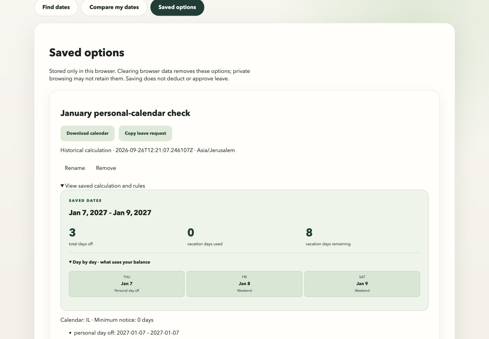
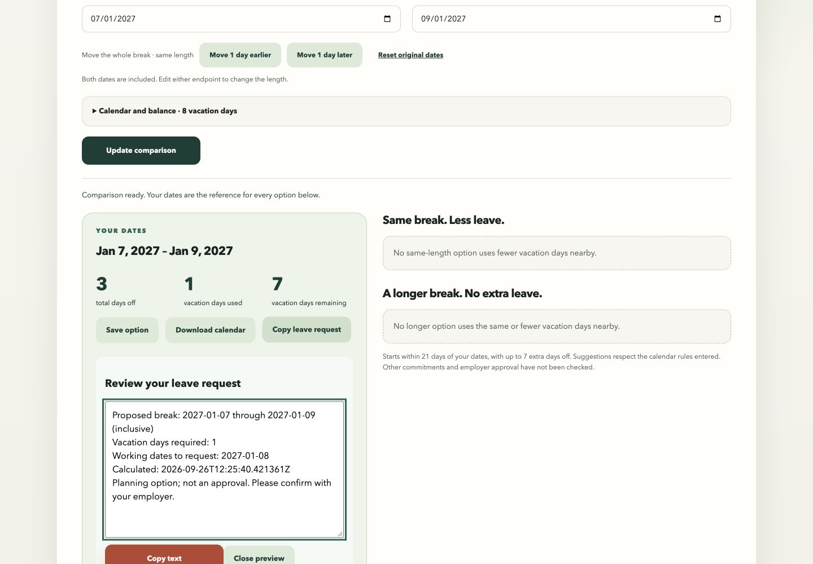

# Phase 0.75 acceptance record

Recorded 2026-09-26. The implementation is in an unmerged stack, #51–#59 plus [#60](https://github.com/rakreshet/vacation-window-planner/pull/60), the final acceptance PR. The local app is available at http://localhost:15173/. Features are implemented; release acceptance remains conditional on real Google Calendar and a second calendar-client import. Those checks are not replaced by parser tests.

## Automated evidence

- Backend: 220 tests pass against disposable PostgreSQL, including existing Phase 0/0.5 behavior, normalized personal calendars, inclusive accounting, all eligibility reasons, opportunity policies/caps, snapshot rollback, and exact Search/Compare action details. Ruff formatting/lint and strict mypy pass. One existing `pydantic_ai` event-loop deprecation warning remains.
- Frontend: 75 tests pass, including original Search/Compare journeys, stale/late-response handling, browser-storage limits/corruption/quota failures, duplicate identity, removal/undo, multi-tab refresh, saved-to-Compare suspension, and clipboard fallback. ESLint, TypeScript, production build, and Prettier pass.
- Calendar output: independent `ical.js` parser checks DATE events, exclusive end dates, stable UID, tentative/transparent status, escaping, 75-byte UTF-8 folding, cross-year/leap/DST dates, zero-leave copy, all eligibility reasons, and date overflow. Implementation follows [RFC 5545](https://www.rfc-editor.org/rfc/rfc5545).
- Real HTTP/PostgreSQL journey: a January 7 personal day off and January 8 extra working day produce exactly one charged date, January 8, for January 7–9. Every Search representative/grouped assessment matches its exact window; stored output equals HTTP output. A fresh session with zero balance returns the correct over-budget reason while retaining the saved timezone.
- GitHub backend/frontend checks pass for #51–#59. Final acceptance PR CI is tracked on that PR.

## Live browser evidence

Used the rebuilt Docker app and PostgreSQL, without an interpretation call. Reviewed at 1,440 × 1,000 CSS pixels.

1. Israel, Friday/Saturday weekends, balance 8, January 2027, preferred length 5, January 7 personal day off: Search's January 7–9 option costs zero leave, with 8 remaining. Separate April opportunities appeared outside the selected month.
2. Saved that exact option, opened the copy preview, and successfully copied the zero-leave wording. Renamed it to “January personal-calendar check.” Historical details show the captured timezone and effective day types.
3. “Check these dates” opened an editable draft without auto-calculating. Added January 8 as an extra working day and explicitly compared. January 7–9 then costs 1 leave day, with 7 remaining; the copy preview lists only January 8 as charged.
4. After rebuilding with acceptance fixes, reloaded the app and confirmed the renamed saved record remained. Keyboard Enter opened saved checking; an unfinished rule disabled Compare; Cancel and Back returned focus to the invoking Check button with saved details still expanded.
5. The Download calendar button raised no application error, but the in-app browser download event timed out. Actual file delivery through that browser remains unverified; parser compliance is verified independently.
6. Automated regression tests additionally verify clipboard denial, obsolete previews, saved focus return, failed rename retention/Escape, cross-tab refresh, unsupported records, and the empty Saved view. These failure states were not all induced in the live browser.

## Performance

Hardware: Apple M5, 32 GiB host RAM, macOS 26.6 arm64. Docker reports 10 CPUs and 8,321,712,128 bytes RAM. Measurements used a warm local production HTTP path with real PostgreSQL, 20 timed requests after one warm-up per fixture. Requests include opportunities and complete action details, five Search results, length 7, and next month. All scans completed; no partial results or request failures occurred.

| Fixture | Candidate pairs | Median | p95 | Maximum |
| --- | ---: | ---: | ---: | ---: |
| Israel | 9,125 | 0.1360 s | 0.1520 s | 0.1549 s |
| U.S. federal | 9,125 | 0.1303 s | 0.1602 s | 0.1613 s |
| England & Wales | 9,125 | 0.1312 s | 0.1625 s | 0.2050 s |
| Israel, 100 overrides + 100 unavailable ranges | 9,125 | 0.9710 s | 1.0068 s | 1.0297 s |

The last fixture places all rules after the scan horizon so each assessed date must scan every range. All p95 values meet the <=2 s target. [Raw evidence](phase075-evidence/performance.json); reproduce with `python3 scripts/measure_phase075.py` against the local disposable app. The script creates anonymous sessions/search snapshots; it never calls interpretation or prints tokens. Timings precede the behavior-preserving assessment-helper extraction; the full regression suite passes after extraction.

## Review findings resolved

Standards review found one functional issue and two maintenance findings: saved over-budget wording, an oversized assessment function, and duplicate saved-list refresh handling. All were addressed with existing or new boundary tests.

Spec review found four issues: saved over-budget wording, saved-check focus/detail restoration, calculation buttons enabled during unfinished rules/country choices, and failed rename/Escape behavior. All were addressed. Additional acceptance checks fixed late Search errors attaching to edited drafts and the empty Compare workspace when leaving a first saved check through task navigation.

## Manual test checklist

Use the local app on the top stack branch. For dates after January 2027, choose equivalent future weekdays.

- Add a personal day off, an extra working weekend day, an unavailable range, and minimum notice. Apply/Cancel is explicit; no calculation runs on edits. Unavailable dates exclude Search suggestions even on weekends. Compare retains literal baseline accounting and explains infeasibility.
- Search, inspect the separate opportunity scores/reasons, and open an opportunity in Compare. Return to Search and verify its draft and feedback remain.
- Expand matching dates on a Search card. Save and copy a different date option; verify its exact endpoints and charged dates, not the representative's.
- Save an option twice; rename it; reload. The name and accounting remain and duplicate save reports “Already saved.” Remove and Undo. Test another browser tab; saved changes refresh there.
- Open saved details while the backend is unavailable: historical viewing/export/copy still work. Check dates opens a draft; explicit Compare uses current server validation and a fresh session. Back restores prior work.
- Open a live copy preview, edit inputs or resubmit, and verify the old preview closes and actions stay disabled until recalculation.
- Use Tab/Shift+Tab and Enter/Space through rule controls, task tabs, Save, rename/Cancel, Copy, and Back. Focus must return to the invoking action.

## Remaining external acceptance

Google Calendar at `https://calendar.google.com/` redirected to the signed-out product page in the available browser session on 2026-09-26. No login or upload was performed. **Actual Google Calendar and second-client imports are pending**, so full release acceptance is not claimed.

Using a disposable calendar, use the generated [January 7–9 fixture](phase075-evidence/january-7-9.ics) or download that option from the app and import it into Google Calendar desktop and Apple Calendar or Outlook. Verify a single all-day event spanning January 7, 8, and 9 only, readable title/description, tentative status where supported, and no attendees. Repeat with a charged-day and cross-year fixture. Record client/version and observed duplicate-import behavior; synchronization is not promised. No events should be sent to anyone.
