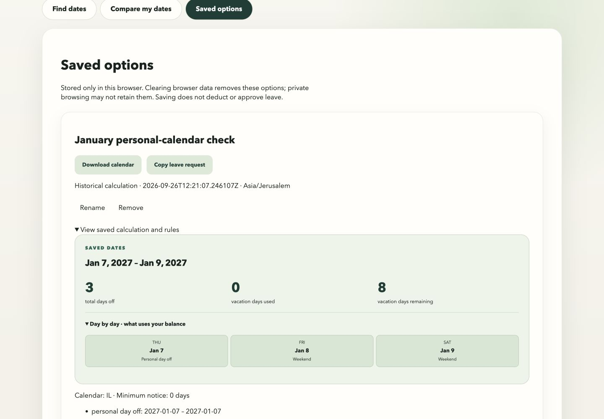
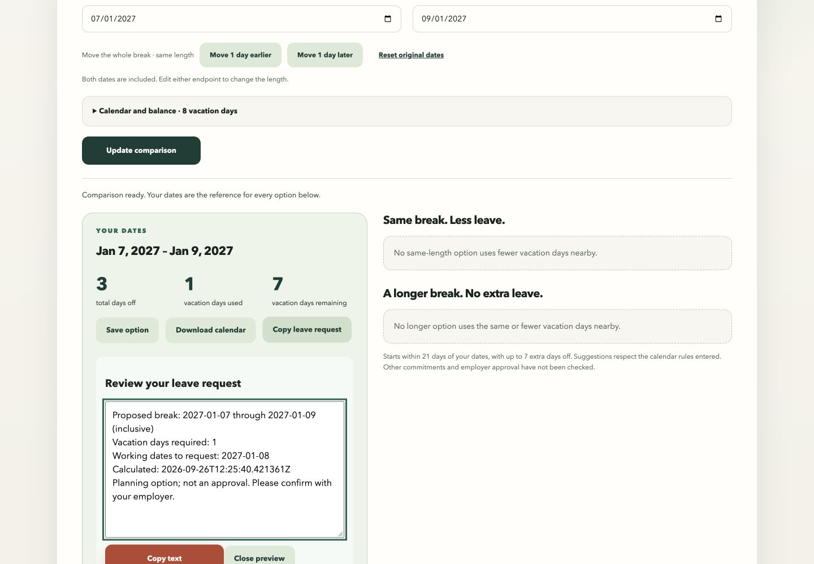

# Phase 0.75 acceptance record

**Scope update — October 2, 2026:** scope follows the [cancellation decision](open-decisions.md#calendar-export-canceled). This record retains planning, browser-save and leave-request copy evidence.

Recorded 2026-09-26 for #51–#59 and [#60](https://github.com/rakreshet/vacation-window-planner/pull/60), the final acceptance PR. The implementation was incorporated into `main` through [#72](https://github.com/rakreshet/vacation-window-planner/pull/72). The measurements below are historical evidence, not fresh verification of the current PR.

## Automated evidence

- Backend: 220 tests pass against disposable PostgreSQL, including existing Phase 0/0.5 behavior, normalized personal calendars, inclusive accounting, all eligibility reasons, opportunity policies/caps, snapshot rollback, and exact Search/Compare action details. Ruff formatting/lint and strict mypy pass. One existing `pydantic_ai` event-loop deprecation warning remains.
- Frontend: 75 tests pass, including original Search/Compare journeys, stale/late-response handling, browser-storage limits/corruption/quota failures, duplicate identity, removal/undo, multi-tab refresh, saved-to-Compare suspension, and clipboard fallback. ESLint, TypeScript, production build, and Prettier pass.
- Real HTTP/PostgreSQL journey: a January 7 personal day off and January 8 extra working day produce exactly one charged date, January 8, for January 7–9. Every Search representative/grouped assessment matches its exact window; stored output equals HTTP output. A fresh session with zero balance returns the correct over-budget reason while retaining the saved timezone.
- GitHub backend/frontend checks pass for #51–#59. Final acceptance PR CI is tracked on that PR.

## Live browser evidence

Used the rebuilt Docker app and PostgreSQL, without an interpretation call. Reviewed at 1,440 × 1,000 CSS pixels.

1. Israel, Friday/Saturday weekends, balance 8, January 2027, preferred length 5, January 7 personal day off: Search's January 7–9 option costs zero leave, with 8 remaining. Separate April opportunities appeared outside the selected month.
2. Saved that exact option, opened the copy preview, and successfully copied the zero-leave wording. Renamed it to “January personal-calendar check.” Historical details show the captured timezone and effective day types.
3. “Check these dates” opened an editable draft without auto-calculating. Added January 8 as an extra working day and explicitly compared. January 7–9 then costs 1 leave day, with 7 remaining; the copy preview lists only January 8 as charged.
4. After rebuilding with acceptance fixes, reloaded the app and confirmed the renamed saved record remained. Keyboard Enter opened saved checking; an unfinished rule disabled Compare; Cancel and Back returned focus to the invoking Check button with saved details still expanded.
5. Automated regression tests additionally verify clipboard denial, obsolete previews, saved focus return, failed rename retention/Escape, cross-tab refresh, unsupported records, and the empty Saved view. These failure states were not all induced in the live browser.

## Performance

Hardware: Apple M5, 32 GiB host RAM, macOS 26.6 arm64. Docker reports 10 CPUs and 8,321,712,128 bytes RAM. Measurements used a warm local production HTTP path with real PostgreSQL, 20 timed requests after one warm-up per fixture. Requests include opportunities and complete action details, five Search results, length 7, and next month. All scans completed; no partial results or request failures occurred.

| Fixture | Candidate pairs | Median | p95 | Maximum |
| --- | ---: | ---: | ---: | ---: |
| Israel | 9,125 | 0.1360 s | 0.1520 s | 0.1549 s |
| U.S. federal | 9,125 | 0.1303 s | 0.1602 s | 0.1613 s |
| England & Wales | 9,125 | 0.1312 s | 0.1625 s | 0.2050 s |
| Israel, 100 overrides + 100 unavailable ranges | 9,125 | 0.9710 s | 1.0068 s | 1.0297 s |

The last fixture places all rules after the scan horizon so each assessed date must scan every range. All p95 values meet the <=2 s target. [Raw evidence](phase075-evidence/performance.json); reproduce with `python3 scripts/measure_phase075.py` against the local disposable app. The script creates anonymous sessions/search snapshots; it never calls interpretation or prints tokens. Timings precede the behavior-preserving assessment-helper extraction; the full regression suite passes after extraction.

## Review findings resolved

Standards review found one functional issue and two maintenance findings: saved over-budget wording, an oversized assessment function, and duplicate saved-list refresh handling. All were addressed with existing or new boundary tests.

Spec review found four issues: saved over-budget wording, saved-check focus/detail restoration, calculation buttons enabled during unfinished rules/country choices, and failed rename/Escape behavior. All were addressed. Additional acceptance checks fixed late Search errors attaching to edited drafts and the empty Compare workspace when leaving a first saved check through task navigation.

## Manual test checklist

Use the local app on the top stack branch. For dates after January 2027, choose equivalent future weekdays.

- Add a personal day off, an extra working weekend day, an unavailable range, and minimum notice. Apply/Cancel is explicit; no calculation runs on edits. Unavailable dates exclude Search suggestions even on weekends. Compare retains literal baseline accounting and explains infeasibility.
- Search, inspect the separate opportunity scores/reasons, and open an opportunity in Compare. Return to Search and verify its draft and feedback remain.
- Expand matching dates on a Search card. Save and copy a different date option; verify its exact endpoints and charged dates, not the representative's.
- Save an option twice; rename it; reload. The name and accounting remain and duplicate save reports “Already saved.” Remove and Undo. Test another browser tab; saved changes refresh there.
- Open saved details while the backend is unavailable: historical viewing/copy still work. Check dates opens a draft; explicit Compare uses current server validation and a fresh session. Back restores prior work.
- Open a live copy preview, edit inputs or resubmit, and verify the old preview closes and actions stay disabled until recalculation.
- Use Tab/Shift+Tab and Enter/Space through rule controls, task tabs, Save, rename/Cancel, Copy, and Back. Focus must return to the invoking action.
